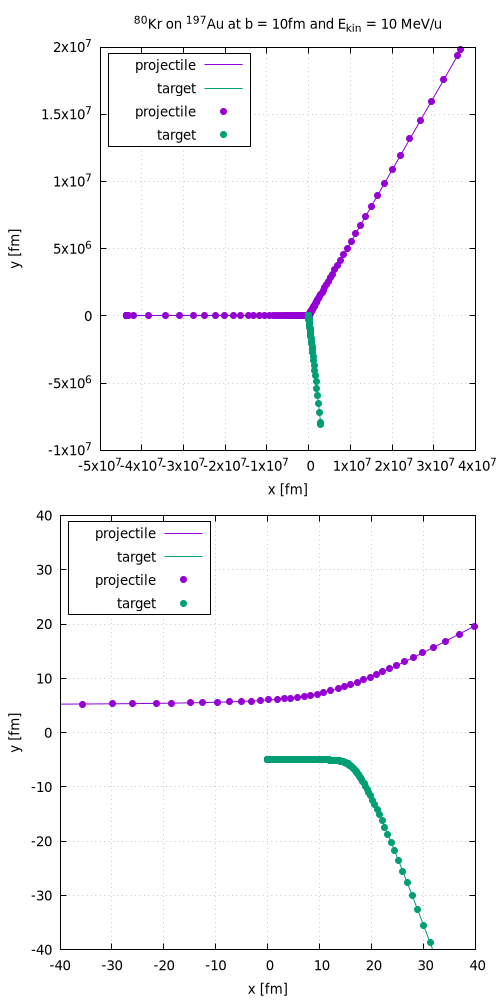

# nuco
Relativistic two-body open orbit simulation. Calculates electrical nuclear Coulomb excitation cross sections. Written in Dlang.

# Requirements
* ldc compiler
* gsl library

# Installation
	git clone https://github.com/miree/nuco.git
	cd nuco
	make

# Run
	# calculate trajectories:
	bash examples/trajectory_Kr_on_Au_01.sh
	# or
	bash examples/trajectory_Kr_on_Au_02.sh

	# calculate excitation and differential cross section:
	bash examples/xsec_Kr_on_Au_01.sh
	# or
	bash examples/xsec_Kr_on_Au_02.sh

If Gnuplot ist installed plots like the following are created:
## 1st trajectory example

## 2nd cross section example

